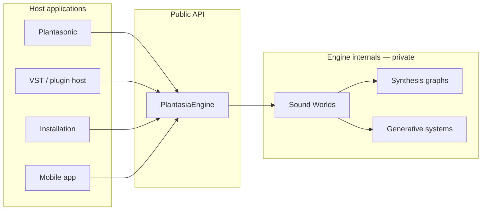

# Public API (v2 — release contract)

> **Status:** Integration beta **`1.0.0-beta.1`** (Phases 8–21). Pin tag `1.0.0-beta.1` — not `v2.0.0`.  
> **Migration:** [MIGRATION_V1_TO_V2.md](./MIGRATION_V1_TO_V2.md) · **Integration:** [PLANTASONIC_INTEGRATION.md](./PLANTASONIC_INTEGRATION.md)
>
> Quick start: see [CREATING_A_SPECIES.md](./CREATING_A_SPECIES.md) · v1 reference: [API_V1.md](./API_V1.md) · Architecture: [SOUND_WORLD_ENGINE.md](./SOUND_WORLD_ENGINE.md)

---

## v2.0 quick start

```typescript
import {
  createSpeciesManager,
  createSpeciesRegistry,
  createPlantasiaEngine,
  loadDefaultSpecies,
  seedSpecies,
  flowersSpecies,
  moldSpecies,
  bacteriaSpecies,
} from 'plantasia-sound-engine';

// v2 — Sound World Engine
const manager = createSpeciesManager();
await loadDefaultSpecies(manager); // Seed
manager.setControl('bloom', 0.7);  // 0–1 normalized
manager.start();
manager.noteOn('C4', 0.85);

// v1 — preset engine (unchanged)
const engine = createPlantasiaEngine();
await engine.init();
engine.playPreset(engine.presets[0]);
```

Run examples after build:

```bash
npm run build
npm run example:basic-engine
npm run example:species-switching
npm run example:midi-performance
npm run example:generative-playback
```

Validate: `npm run test`

---

## Overview

Applications interact with the Plantasia Sound Engine through a **clean public API** — never by reaching into Tone.js nodes, Web Audio graphs, or internal synthesis modules.

The engine is a black box. Host apps (Plantasonic, VST wrappers, installations, mobile clients) send high-level commands — load a species, play a note, adjust ecological controls — and receive events. They do not need to know which oscillators, effects, or generators a Sound World uses internally.



**Boundary rule:** If a host imports `tone` or reads `src/engine/audioEngine.ts`, it has crossed the contract. All audio behavior flows through the API defined here.

---

## Core concepts

### Engine

The central controller responsible for:

- Loading and switching Sound Worlds (species)
- Routing notes and scheduling musical events
- Managing audio resources (context lifecycle, voice allocation, metering)
- Bridging MIDI, transport, and ecological controls into the active world
- Emitting events for UI and visualization layers

The Engine is the only object a host application constructs.

### Sound World

A complete audiovisual ecosystem with its own synthesis architecture, modulation routing, effects chain, and generative behavior. Sound Worlds are interchangeable — switching species replaces the entire internal graph without the host reconfiguring anything.

See [SOUND_WORLD_ENGINE.md](./SOUND_WORLD_ENGINE.md) for layers (synth, controls, mold profile, visual, MIDI).

#### Sound World interface

Every species implementation must satisfy the shared `SoundWorld` contract in `src/engine/SoundWorld.ts`. The engine loads a species, calls `initialize()` once, then forwards performance and control commands through this interface — never through Tone.js nodes or internal graph objects.

```typescript
import type { SoundWorld, SpeciesId, EcologicalControl } from '../engine/SoundWorld.js';

// Each species (Seed, Flowers, Mold, Bacteria) implements SoundWorld internally.
// Host applications use PlantasiaEngine — not SoundWorld directly.
```

| Method | Purpose |
|--------|---------|
| `initialize(context)` | Prepare audio resources for this world |
| `start()` / `stop()` | Arm or disarm note input and generative output |
| `noteOn` / `noteOff` / `allNotesOff` | Real-time performance |
| `setControl(control, value)` | Ecological knobs — species receive 0–100 internally; see `EcologyControls` for normalized 0–1 API |
| `dispose()` | Release world-specific resources |

Applications interact with **one engine facade** that delegates to the active `SoundWorld`. They must not import `tone`, reach into `audioEngine.ts`, or call species graph builders directly.

#### SpeciesManager

`SpeciesManager` (`src/engine/SpeciesManager.ts`) is the engine-level registry for Sound Worlds. Use `createSpeciesManager()` to get a manager with all four species; **Seed is the default** (`DEFAULT_SPECIES_ID = 'seed'`).

**Not wired** into the v1 `PlantasiaEngine` runtime or browser demo — use `SpeciesManager` directly for all four v2 species. Legacy `playPreset()` remains unchanged.

```typescript
import { createSpeciesManager, loadDefaultSpecies } from '../engine/createSpeciesManager.js';

const speciesManager = createSpeciesManager();

await loadDefaultSpecies(speciesManager); // Seed — default

await speciesManager.loadSpecies('bacteria');

speciesManager.setControl('bacteria', 1.0);
speciesManager.setControl('growth', 0.7);

// Or use the shared control layer directly:
const ecology = speciesManager.getEcologyControls();
ecology.set('bloom', 0.4);
ecology.applyTo(activeSoundWorld);

speciesManager.start();
speciesManager.noteOn('C4', 0.8);
```

### Seed reference implementation

`src/species/seed/` is the canonical Sound World layout:

- `metadata.ts` — species identity and defaults
- `synth.ts` — voice architecture (Tone.js PolySynth)
- `effects.ts` — effects chain
- `generator.ts` — generative behavior
- `index.ts` — `SoundWorld` facade

See [SPECIES.md](./SPECIES.md) for ecological control mappings.

### Flowers reference implementation

`src/species/flowers/` follows the same layout with Juno-inspired subtractive synthesis:

- `metadata.ts` — 64 BPM, major scale, chord voicings
- `synth.ts` — saw + pulse + sub + noise stack, slow attack, long release
- `effects.ts` — dual chorus (central to identity), hall reverb, stereo delay, widener
- `generator.ts` — slow chord blooms, gentle arpeggios, sparkle notes
- `index.ts` — `FlowersSoundWorld` via `createFlowersSoundWorld()`

### Mold reference implementation

`src/species/mold/` is the engine's decay Sound World — texture and degradation, not melody:

- `metadata.ts` — concept, inspiration, oscillators, effects, control mapping
- `synth.ts` — sine drones, soft FM, filtered harmonics, brown noise bed
- `effects.ts` — tape, distortion, bit crush, comb, feedback delays, vibrato, long reverb; continuous LFO modulation
- `generator.ts` — slow drones, sparse clusters, harmonic decay, long silences, bacteria glitches
- `index.ts` — `MoldSoundWorld` via `createMoldSoundWorld()`

The `mold` ecological control is the primary identity knob for this species (tape wear, flutter, feedback, distortion).

### Bacteria reference implementation

`src/species/bacteria/` is the engine's particle Sound World — the generator is the identity:

- `metadata.ts` — concept, generator philosophy, oscillators, effects, control mapping
- `synth.ts` — NoiseSynth, FM micro-voices, sine blips, PluckSynth impulses
- `effects.ts` — gentle saturation, auto-pan, micro ping-pong delay, small room reverb
- `generator.ts` — probability swarms, random walks, micro-fragments, background ticks
- `index.ts` — `BacteriaSoundWorld` via `createBacteriaSoundWorld()`

The `bacteria` ecological control is the primary identity knob for this species (particle density, trigger probability, swarm complexity).

| Method | Purpose |
|--------|---------|
| `createSpeciesManager()` | Factory — registers all four live Sound Worlds |
| `loadDefaultSpecies(manager)` | Load Seed (`DEFAULT_SPECIES_ID`) |
| `manager.loadDefaultSpecies()` | Same — instance method on `SpeciesManager` |
| `register(world)` | Add a `SoundWorld` to the registry |
| `getAvailableSpecies()` | List registered species metadata |
| `getCurrentSpecies()` | Active species metadata, or `null` |
| `loadSpecies(id, context?)` | Dispose previous world, initialize next |
| `start()` / `stop()` | Delegate lifecycle to active species |
| `noteOn` / `noteOff` / `allNotesOff` | Delegate performance to active species |
| `setControl(control, value)` | Set ecological control (normalized **0–1**); persisted across species switches |
| `getEcologyControls()` | Access shared `EcologyControls` instance (get/set state, reset, apply) |
| `dispose()` | Tear down active species and clear registry |

When integrated, `PlantasiaEngine.loadSpecies()` will delegate to `SpeciesManager` internally. The v1 preset system (`playPreset`, `presets` array) remains in place until a later migration phase.

Run `npm run test:species` and `npm run test:ecology` after build.

#### EcologyControls

`EcologyControls` (`src/engine/EcologyControls.ts`) centralizes the five shared ecological knobs. Values are **normalized 0.0–1.0** and clamped automatically. The host app does not need to know how each species maps a control internally.

```typescript
import { EcologyControls } from '../engine/EcologyControls.js';

const controls = new EcologyControls();

controls.set('growth', 0.7);
controls.set('bloom', 0.4);
controls.set('roots', 0.6);
controls.set('mold', 0.2);
controls.set('bacteria', 0.5);

controls.get('growth');   // 0.7
controls.getState();      // full snapshot
controls.reset();         // restore defaults
controls.applyTo(soundWorld); // push state → species setControl (0–100 internally)
```

`SpeciesManager` holds an `EcologyControls` instance:

- `setControl()` updates stored state and routes to the active species
- `loadSpecies()` applies the current ecological state to the newly loaded world
- Controls set before any species is loaded are stored and applied on first `loadSpecies()`

Species-specific mappings remain in each species `setControl()` — same control name, different behavior per world.

#### Generative Engine

All four species delegate musical output to the shared **Generative Ecosystem Engine** (`src/engine/generative/`). Species supply `GenerativePreferences` in metadata; thin adapters in `src/species/*/generator.ts` route note events to synth graphs.

```typescript
import { Generator } from '../engine/generative/Generator.js';
import { SEED_GENERATIVE_PREFERENCES } from '../species/seed/metadata.js';
```

Ecological controls influence **composition** (density, phrases, drones, particles) as well as synthesis. See [GENERATIVE_ENGINE.md](./GENERATIVE_ENGINE.md).

Run `npm run test:generative` after build.

#### Performance Engine

All four species use the shared **Expressive Performance Engine** (`src/engine/performance/`). Velocity, density, ecological macros, and generative activity route through `ExpressionRouter` into `PerformanceTargets` — species apply targets via `performanceApply.ts`, not hard-coded routing in `index.ts`.

```typescript
import { PerformanceEngine } from '../engine/performance/PerformanceEngine.js';
import { SEED_EXPRESSION_PROFILE } from '../species/seed/expressionProfile.js';
```

Each species defines an **expression profile** (character, velocity weights, density weights, macro expansion). Ecological controls act as high-level expressive macros influencing filter, envelope, space, saturation, and instability simultaneously.

See [PERFORMANCE_ENGINE.md](./PERFORMANCE_ENGINE.md).

Run `npm run test:performance` after build.

#### Plugin Architecture (Species SDK)

Sound Worlds register as **plugins** through `SpeciesRegistry` — the engine core does not hard-code species imports.

```typescript
import {
  SpeciesManager,
  SpeciesRegistry,
  registerBuiltinSpecies,
  createSpeciesManager,
} from '../engine/index.js';

// Default — all built-in + coming_soon placeholders
const manager = createSpeciesManager();

// Custom registry — add your own plugin
const registry = new SpeciesRegistry();
registerBuiltinSpecies(registry);
registry.register({ factory: createMySoundWorld });

const customManager = new SpeciesManager(registry);
```

| API | Purpose |
|-----|---------|
| `SpeciesRegistry` | Register, validate, discover species |
| `SpeciesLoader` | Load/dispose lifecycle with error handling |
| `registerBuiltinSpecies()` | Bootstrap seed, flowers, mold, bacteria + future placeholders |
| `getActiveSpecies()` | Loadable species only |
| `getUpcomingSpecies()` | `coming_soon` placeholders |

Adding a species: copy `src/templates/species-template/`, implement, add one line to `registerBuiltinSpecies.ts`. See [PLUGIN_ARCHITECTURE.md](./PLUGIN_ARCHITECTURE.md) and [CREATING_A_SPECIES.md](./CREATING_A_SPECIES.md).

Run `npm run test:registry` after build.

### Species

A selectable Sound World exposed to the host as one of four organism archetypes:

| Species ID | Archetype | Character |
|------------|-----------|-----------|
| `seed` | Birth | Plantasonic-inspired emergence, intimate warmth |
| `flowers` | Bloom | Juno-inspired harmonic growth, chorus-rich petals |
| `mold` | Decay | Tape wear, spectral drift, haunting ambient erosion |
| `bacteria` | Microscopic motion | Particle swarms, stochastic life, generative jitter |

`loadSpecies()` is the primary entry point for world selection. Internally, a species may map to one or more Sound World definitions; the host only sees the species ID.

### Ecological Controls

Five shared controls (`growth`, `bloom`, `roots`, `mold`, `bacteria`) normalized to **0.0–1.0** via `EcologyControls`. The same `set('bloom', 0.8)` means different things per species — mappings live inside each Sound World, not in the shared layer.

| Control | General meaning |
|---------|-----------------|
| `growth` | Envelope and temporal expansion — how fast life unfolds |
| `bloom` | Harmonic and spatial opening — petals, chorus, air |
| `roots` | Foundation and body — sub energy, earthy weight |
| `mold` | Degradation and time — tape, mutation, haunted ambience |
| `bacteria` | Microscopic motion — particles, randomness, cellular activity |

Per-species interpretation: [SPECIES.md](./SPECIES.md#four-species-comparison).

Ecological controls are the **only** performance knobs hosts should expose. Low-level parameters (`filterHz`, oscillator type, LFO rate) remain internal.

---

## Draft public API

The following TypeScript sketches describe the intended surface. Method names and signatures may be refined during implementation, but the **capabilities** are stable design targets.

### Construction

```typescript
import { PlantasiaEngine } from 'plantasia-sound-engine';

const engine = new PlantasiaEngine();
```

### Lifecycle

```typescript
/** Start audio context. Must be called from a user gesture in browser hosts. */
await engine.initialize();

/** Arm the engine for note input and generative scheduling. */
engine.start();

/** Release all voices and halt generative output. Audio context may remain open. */
engine.stop();

/** Tear down audio resources. */
engine.dispose();
```

### Species

```typescript
engine.loadSpecies('seed');
engine.loadSpecies('flowers');
engine.loadSpecies('mold');
engine.loadSpecies('bacteria');

const current = engine.getCurrentSpecies();
// 'seed' | 'flowers' | 'mold' | 'bacteria'

const available = engine.getAvailableSpecies();
// ['seed', 'flowers', 'mold', 'bacteria']
```

`loadSpecies()` is atomic: the previous world's graph is torn down, the new world's graph is constructed, ecological controls are restored to species defaults, and a `speciesChanged` event is emitted.

### Note API

Real-time performance interface for keyboard, MIDI, and sequencers.

```typescript
engine.noteOn('C4', 0.85);
engine.noteOn(60, 100);   // MIDI note number + velocity 0–127 also supported

engine.noteOff('C4');
engine.noteOff(60);

engine.allNotesOff();
```

Notes are routed through the active species graph. Polyphony, voice stealing, and per-species voice behavior are engine-managed.

### Ecological controls

```typescript
engine.setGrowth(42);    // 0–100
engine.setBloom(68);
engine.setRoots(35);
engine.setMold(18);
engine.setBacteria(55);

const growth = engine.getGrowth();
const bloom = engine.getBloom();
// ... getters for each ecological control
```

Each setter emits `parameterChanged` with the control id and new value. Species-specific mapping is internal.

### Transport

For sequenced, generative, and installation hosts.

```typescript
engine.play();
engine.pause();
engine.stop();           // also releases notes when called from transport context
engine.setTempo(96);     // BPM
```

Transport state is independent of audio context lifecycle. `play()` resumes generative scheduling; `pause()` suspends it without releasing held notes unless configured otherwise.

### Metering and visualization

Hosts read output state without touching the audio graph.

```typescript
const waveform = engine.getWaveform();  // Float32Array for scopes
const level = engine.getLevel();        // 0–1 normalized output
```

### MIDI

```typescript
await engine.enableMIDI();
engine.disableMIDI();

engine.learnControl('bloom');   // next MIDI CC maps to bloom
const devices = await engine.getMIDIDevices();
```

MIDI input routes through the Note API and ecological control mapping. MPE and aftertouch are future extensions (see [Future expansion](#future-expansion)).

### Events

The engine emits typed events for decoupled UI and visualization.

```typescript
engine.on('speciesChanged', (event) => {
  // event.species: SpeciesId
  // event.visual: PresetVisualConfig | undefined
});

engine.on('notePlayed', (event) => {
  // event.note, event.velocity, event.species
});

engine.on('noteReleased', (event) => {
  // event.note
});

engine.on('transportStarted', () => {});
engine.on('transportStopped', () => {});

engine.on('midiConnected', (event) => {
  // event.deviceId, event.name
});

engine.on('midiDisconnected', (event) => {
  // event.deviceId
});

engine.on('parameterChanged', (event) => {
  // event.id: 'growth' | 'bloom' | 'roots' | 'mold' | 'bacteria'
  // event.value: number
});
```

| Event | When emitted |
|-------|--------------|
| `speciesChanged` | `loadSpecies()` completes |
| `notePlayed` | `noteOn()` triggers a voice |
| `noteReleased` | `noteOff()` releases a voice |
| `transportStarted` | `play()` called |
| `transportStopped` | `pause()` or transport `stop()` |
| `midiConnected` | MIDI device attached |
| `midiDisconnected` | MIDI device removed |
| `parameterChanged` | Any ecological control changes |

Hosts subscribe to events; the engine never calls into host UI code directly.

### Example integration

```typescript
import { PlantasiaEngine } from 'plantasia-sound-engine';

const engine = new PlantasiaEngine();

engine.on('speciesChanged', ({ species }) => {
  console.log(`Now playing: ${species}`);
});

document.querySelector('#start')!.addEventListener('click', async () => {
  await engine.initialize();
  engine.loadSpecies('seed');
  engine.setMold(12);
  engine.setBloom(45);
  engine.start();
  await engine.enableMIDI();
});

document.querySelector('#play')!.addEventListener('click', () => {
  engine.noteOn('E3', 0.7);
});
```

---

## Types

### Sound World contract (defined)

Formal interface: `src/engine/SoundWorld.ts` (re-exported from `src/engine/index.ts`).

```typescript
/** Open string — plugins register their own IDs (e.g. 'seed', 'night-bloom'). */
export type SpeciesId = string;

export type SpeciesStatus = 'active' | 'coming_soon' | 'disabled';

export type EcologicalControl =
  | 'growth'
  | 'bloom'
  | 'roots'
  | 'mold'
  | 'bacteria';

export interface SoundWorldMetadata {
  id: SpeciesId;
  name: string;
  concept: string;
  description: string;
  inspiration: string[];
  character: string[];
  status?: SpeciesStatus;
  version?: string;
}

export interface SoundWorld {
  metadata: SoundWorldMetadata;
  initialize(context: unknown): Promise<void> | void;
  start(): void;
  stop(): void;
  noteOn(note: string, velocity?: number): void;
  noteOff(note: string): void;
  allNotesOff(): void;
  setControl(control: EcologicalControl, value: number): void;
  dispose(): void;
}
```

export interface SoundWorld {
  metadata: SoundWorldMetadata;
  initialize(context: unknown): Promise<void> | void;
  start(): void;
  stop(): void;
  noteOn(note: string, velocity?: number): void;
  noteOff(note: string): void;
  allNotesOff(): void;
  setControl(control: EcologicalControl, value: number): void;
  dispose(): void;
}
```

### Engine events (draft)

```typescript
type EngineEventMap = {
  speciesChanged: { species: SpeciesId; visual?: PresetVisualConfig };
  notePlayed: { note: string | number; velocity: number; species: SpeciesId };
  noteReleased: { note: string | number };
  transportStarted: Record<string, never>;
  transportStopped: Record<string, never>;
  midiConnected: { deviceId: string; name: string };
  midiDisconnected: { deviceId: string };
  parameterChanged: { id: EcologicalControl; value: number };
};
```

Full type exports will ship from `plantasia-sound-engine` once v2 is implemented. Hosts should import types from the package barrel, not from `src/`.

---

## Design goals

| Principle | Rationale |
|-----------|-----------|
| **Stable API across versions** | Host apps (Plantasonic, plugins) compile against a semver-guaranteed surface. Internal refactors do not break consumers. |
| **No Tone.js in hosts** | Synthesis library is an implementation detail. Future backends (AudioWorklet, native) swap without host changes. |
| **Interchangeable Sound Worlds** | Any species loads through the same `loadSpecies()` call. No special-case host code per world. |
| **Extensible species registry** | New species add JSON definitions + internal graph wiring. The public API gains new IDs, not new methods. |
| **Browser first, platform portable** | API designed for Web Audio and user-gesture initialization; shapes map cleanly to VST, mobile, and embedded targets. |
| **Separation of engine, UI, visualization** | Engine emits audio and events. Hosts own rendering, layout, and interaction. Visual metadata travels via events, not side effects. |

---

## Migration from v1

The v1 API (`PlantasiaEngine.init()`, `playPreset()`, `applyBotanicalControls()`) remains available during transition. v2 introduces species-centric and note-centric methods as the primary interface.

| v1 (current) | v2 (target) |
|--------------|-------------|
| `init()` | `initialize()` |
| `playPreset(preset)` | `loadSpecies(id)` + `noteOn()` |
| `triggerChord()` | `noteOn()` × N |
| `applyBotanicalControls()` | `setGrowth()`, `setBloom()`, etc. |
| `setMold()` | `setMold()` (unchanged semantic) |
| `stop()` | `allNotesOff()` + `stop()` |

Full v1 reference: [API_V1.md](./API_V1.md).

---

## Future expansion

The following sections reserve API surface for later milestones. **Not implemented.** Listed here so hosts and engine authors share a common roadmap.

### Plugin hosting

Embed the engine inside DAW plugin wrappers. Reserve `engine.getPluginDescriptor()` for parameter count, layout, and bus configuration without exposing internal nodes.

### VST compatibility

Map ecological controls to VST parameters. Species switching maps to program change or a dedicated species parameter. Audio I/O through host buffer contracts.

### AudioWorklet integration

Move heavy synthesis off the main thread. `initialize()` negotiates worklet vs main-thread backend transparently — hosts see the same API.

### Granular synthesis

Species-internal capability. Bacteria and Mold archetypes may expose granular engines behind ecological controls without new public methods.

### Spatial audio

Reserve `engine.setSpatialConfig()` for HRTF, ambisonics, and multi-speaker installations. Visualization hosts receive position metadata via events.

### AI-generated Sound Worlds

Reserve `engine.loadSpecies('custom', { worldId })` overload for procedurally authored or AI-generated world definitions loaded at runtime.

### Motion and sensor input

Reserve `engine.bindSensor(source, control)` for accelerometer, light, and biofeedback mapping to ecological controls.

### OSC support

Reserve `engine.enableOSC({ port })` for installation and Max/MSP integration. OSC addresses mirror ecological control IDs.

### WebRTC collaboration

Reserve session APIs for multi-user performances — shared species state, synchronized transport, remote ecological control via data channels.

---

## Related docs

- [SOUND_WORLD_ENGINE.md](./SOUND_WORLD_ENGINE.md) — Sound World architecture and organism archetypes
- [API_V1.md](./API_V1.md) — Current shipped API (v1 baseline)
- [PRESETS.md](./PRESETS.md) — Sound World JSON schema
- [ARCHITECTURE.md](./ARCHITECTURE.md) — Internal subsystem layout (engine authors only)
