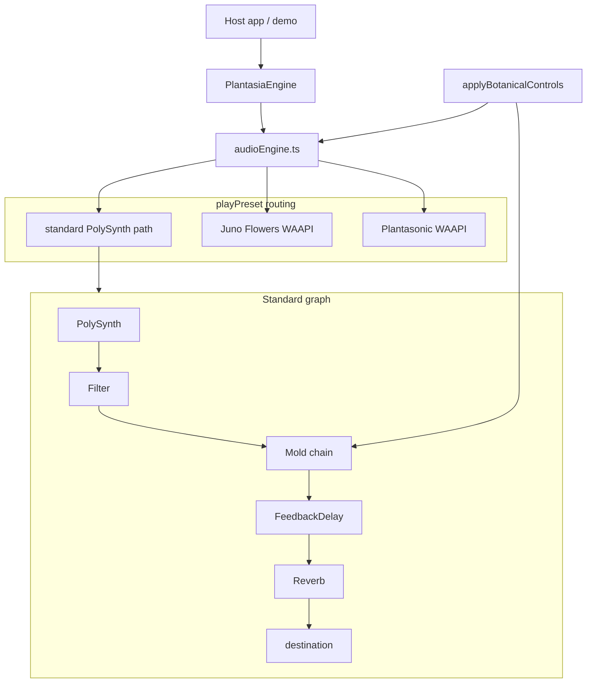

# Engine Audit — v1 to Sound World Engine

> **Status:** Analysis and migration planning only (Task 2.4). No implementation changes.  
> Baseline: tag `v1-sound-engine-baseline` on branch `v2-sound-world-engine`.  
> Target contract: [API.md](./API.md) · Architecture vision: [SOUND_WORLD_ENGINE.md](./SOUND_WORLD_ENGINE.md)

This document audits the current Plantasia Sound Engine against the v2 Sound World architecture and serves as the migration guide.

---

## 1. Current architecture

### Main entry point

| Layer | Path | Role |
|-------|------|------|
| Package barrel | `src/index.ts` | Public exports (facade, presets, mold, synth helpers) |
| Facade class | `src/engine/plantasiaEngine.ts` | Thin wrapper delegating to `audioEngine.ts` |
| Core runtime | `src/engine/audioEngine.ts` | Audio init, preset playback, botanical mapping, metering |
| Preset registry | `src/presets/loader.ts` | Bundled JSON → `PlantasiaPreset[]` |
| Signature synths | `src/synths/junoFlowersAudio.ts`, `plantasonicAudio.ts` | Web Audio API live-voice graphs |
| Mold engine | `src/mold/` | Living degradation macro (shared across all paths) |

Hosts import `plantasia-sound-engine` and construct `PlantasiaEngine`. There is no `SpeciesManager`, no event bus, and no unified `noteOn` / `noteOff` surface.

### Audio initialization

- `PlantasiaEngine.init()` → `initAudio()` in `audioEngine.ts`
- Lazily builds the standard Tone.js graph via `ensureNodes()` on first use
- Calls `Tone.start()` once (user gesture required in browsers)
- Signature graphs call `Tone.start()` again inside `ensureJunoRuntime()` / `ensurePlantasonicRuntime()` and grab `Tone.getContext().rawContext` as a native `AudioContext`

### Preset management

- Source of truth: `presets/**/*.json` synced to `src/presets/bundled/` at build
- `loader.ts` imports each JSON statically and maps through `presetFromJson()`
- Lookup: `getPresetById()`, `getPresetsByCategory()`, alias resolution via `aliases.ts`
- Routing inference: `routing.ts` → `standard` | `botanical` | `plantasonic`
- Control defaults: `controlDefaults.ts` → `getPresetControls()`, `getPresetMold()`
- Validation: `validatePresets.ts` (visual themes, control ranges)

`playPreset()` both **loads** synth settings and **triggers a demo chord** — there is no load-without-play API.

### MIDI handling

**Not implemented.** Scaffold only:

- `src/midi/types.ts` — `MidiManager`, `MidiDeviceInfo`, `MidiLearnMapping`, `MpeConfig`
- `createMidiManager()` returns empty stubs
- `examples/midi/` uses keyboard keydown, not Web MIDI
- `ENGINE_PARAMETER_METADATA` in mold is ready for MIDI Learn but no runtime wiring exists
- Plantasonic has `PlantasonicPerformanceState` (growth, aftertouch, expression) but no MIDI input path

### Keyboard handling

**Not in the engine.** Host applications and examples handle keyboard:

- `examples/midi/main.js` — `keydown` → `triggerChord()`
- `demo/main.js` — UI buttons for Play Note / Stop
- Juno and Plantasonic live-voice APIs exist (`createJunoLiveVoice`, `createPlantasonicLiveVoice`) but are not called from a central note router

### Sequencing

**Not implemented.** Scaffold only:

- `src/sequencing/types.ts` — `EuclideanPattern`, `ArpMode`, `ScaleQuantizer`, `ProbabilityGate`, `SequencerState`
- `createSequencerState()` returns empty state
- No arpeggiator, Euclidean engine, or scale quantizer wired to audio

### Scheduling

| Mechanism | Location | Purpose |
|-----------|----------|---------|
| `Tone.getTransport()` | `audioEngine.ts` `setTempo()` | BPM only — no sequenced events |
| `window.setTimeout` | `junoFlowersAudio.ts`, `plantasonicAudio.ts` | Auto-release demo voices after hold time |
| `setInterval` tick loops | Juno / Plantasonic | `tickJunoLivingVoice`, `tickPlantasonicLivingVoice` — growth stages, living random targets |
| `AudioContext.currentTime` | Signature synths | Envelope scheduling on voice creation |

No central scheduler, no transport play/pause, no event queue.

### Effects routing

**Three parallel effect architectures:**

1. **Standard path** (`audioEngine.ts`): inline `Tone.FeedbackDelay` + `Tone.Reverb`; Mold chain inserted between filter and delay (`wireMoldChain`)
2. **Juno Flowers** (`junoFlowersAudio.ts`): custom WAAPI — pollen chorus delays, morning-mist reverb, FX delay feedback, wind LFO pan, master compressor
3. **Plantasonic** (`plantasonicAudio.ts`): custom WAAPI — tape saturation, dual filters, chorus LFO, hall reverb, delay, compressor, width LFO, pink-noise texture layer

`src/effects/` is a placeholder (`EffectRack`, `EffectModule`) — not used by runtime.

### Modulation

| Location | Modulation |
|----------|------------|
| `audioEngine.ts` | Single `Tone.LFO` → filter frequency; drift param expands LFO range |
| `applyMold.ts` | Four Mold LFOs (wow, flutter, filter Q, pan) + ring mod via `Tone.Vibrato` |
| `junoFlowersAudio.ts` | Per-voice LFO, wind LFO on graph, growth-stage blends |
| `plantasonicAudio.ts` | Chorus LFO, width LFO, per-voice drift/amp LFOs, evolution stages |

`src/modulation/` is a placeholder (`ModulationMatrix`) — not used by runtime.

### Utility modules

| Module | Role |
|--------|------|
| `src/utils/ramp.ts` | `setRampParam()` — smooth param changes when audio context started |
| `src/utils/types/botanical.ts` | `BotanicalControls` (11 keys), species names, organism states |
| `src/utils/types/soundWorld.ts` | v2-oriented types (control surface, visual, MIDI) — partially adopted in presets |
| `src/utils/types/presets.ts` | `PlantasiaPreset`, `SynthSettings` |
| `src/presets/serialize.ts` | JSON round-trip |
| `src/presets/themeRegistry.ts` | Valid ASCII theme keys for host apps |
| `src/mold/moldMacro.ts`, `stages.ts`, `modules.ts` | Mold resolution pipeline |

### Current audio flow



---

## 2. Current Tone.js usage

### Inventory

| Object | File(s) | Purpose | Shared or per-world |
|--------|---------|---------|---------------------|
| `Tone.PolySynth(Tone.Synth)` | `audioEngine.ts` | Standard preset voices | **Shared** engine graph — should move under Seed species default |
| `Tone.Filter` | `audioEngine.ts`, `applyMold.ts` (host) | Lowpass on standard path | Shared standard graph |
| `Tone.FeedbackDelay` | `audioEngine.ts`, `applyMold.ts` | Main delay + Mold micro-delay | Shared; Mold owns secondary delay |
| `Tone.Reverb` | `audioEngine.ts` | Spatial tail on standard path | Shared standard graph |
| `Tone.LFO` | `audioEngine.ts` (filter), `applyMold.ts` (×4) | Filter sweep + Mold wow/flutter/Q/pan | Shared Mold + standard filter LFO |
| `Tone.Analyser` | `audioEngine.ts` | Waveform visualization | **Engine-level** (keep shared) |
| `Tone.Meter` | `audioEngine.ts` | Output level metering | **Engine-level** (keep shared) |
| `Tone.Distortion` ×2 | `applyMold.ts` | Tape wear + harmonic distortion | Shared Mold chain |
| `Tone.BitCrusher` | `applyMold.ts` | Spectral decay | Shared Mold chain |
| `Tone.Vibrato` | `applyMold.ts` | Ring modulation proxy | Shared Mold chain |
| `Tone.Noise` | `applyMold.ts` | Texture crackle | Shared Mold chain |
| `Tone.Gain` | `applyMold.ts` | Texture level | Shared Mold chain |
| `Tone.Panner` | `applyMold.ts` | Stereo instability | Shared Mold chain |
| `Tone.Transport` | `audioEngine.ts` | Tempo BPM | **Engine-level** (keep shared) |
| `Tone.start()` | `audioEngine.ts`, signature synths | Context unlock | **Engine-level** |
| `Tone.Frequency` | `junoFlowersAudio.ts`, `plantasonicAudio.ts` | Note name → Hz | **Engine-level** utility |
| `Tone.gainToDb` | `applyMold.ts` | Noise volume scaling | Mold internal |

### Not used (Tone.js)

No `MonoSynth`, `FMSynth`, `AMSynth`, `NoiseSynth`, `Tone.Chorus`, or `Tone.Compressor` in the codebase. Chorus and compression on signature paths are hand-built with native `OscillatorNode`, `DelayNode`, and `DynamicsCompressorNode`.

### Web Audio API (signature synths)

| Node type | Juno | Plantasonic | Belongs to |
|-----------|------|-------------|------------|
| `OscillatorNode` | Per-voice + wind LFO | Per-voice + chorus/width/drift LFOs | **Flowers** / **Seed** species internals |
| `BiquadFilterNode` | Voice + graph filters | Dual voice filters + graph filters | Species internals |
| `GainNode` | Throughout | Throughout | Species internals |
| `DelayNode` | Pollen, FX, morning mist | Chorus, FX, hall | Species internals |
| `WaveShaperNode` | Photosynthesis saturation | Tape saturation | Species internals |
| `DynamicsCompressorNode` | Master limiter | Master compressor | Species internals |
| `StereoPannerNode` | Voice pan + wind | Voice pan + width | Species internals |
| `AudioBufferSourceNode` | — | Pink noise texture | Plantasonic / Seed |

---

## 3. Preset audit

Eleven bundled presets. `playPreset()` behavior: applies settings, sets mold profile, triggers `['C3','G3','B3']` chord (or signature live voices).

### Summary table

| ID | Display name | Routing | Mold profile | v2 species | Recommendation |
|----|--------------|---------|--------------|------------|----------------|
| `plantasonic` | Plantasonic | `plantasonic` | `plantasonic` | **Seed** | Keep as Seed flagship |
| `seed` | Moss | `standard` | `generic` | **Seed** | Keep — Seed archetype default |
| `root` | Roots | `standard` | `roots` | **Seed** | Keep — earthy Seed variant |
| `bloom` | Bloom | `standard` | `bloom` | **Flowers** | Keep — Flowers archetype default |
| `fern` | Canopy | `standard` | `bloom` | **Flowers** | Keep — wide pad Flowers variant |
| `vine` | Rainforest | `standard` | `roots` | **Mold** | Keep — remap to Mold; dense decay ambience |
| `juno-flowers` | Night Bloom | `botanical` | `plantasonic` | **Flowers** | Keep as Flowers flagship |
| `coral` | Desert | `standard` | `rainforest` | **Seed** | Keep — sparse Seed / neutral |
| `mycelium` | Mycelium | `standard` | `rainforest` | **Bacteria** | Keep — Bacteria archetype seed |
| `mutation` | Mutation | `standard` | `night-bloom` | **Bacteria** / **Mold** | Keep — high mutation; split force between archetypes |
| `crystal` | Winter | `standard` | `winter` | **Mold** | Keep — spectral decay / haunted ice |

None recommended for retirement. All have visual metadata, control surfaces, and distinct synth character. Category manifest in `presets/default.json` has some redundancy (`coral` listed under `soundWorlds` while JSON says `soundWorlds`; `mycelium` under `ambient` only).

### Per-preset detail

#### `plantasonic` (signature)

- **Architecture:** Dual-oscillator WAAPI voices (saw + triangle), evolution stages (dormant → ecosystem), pink-noise texture, custom chorus/delay/hall chain
- **Effects:** Tape sat → dual LP filter → chorus → delay → hall reverb → compressor → stereo width
- **Scale:** Explicit Hz array in JSON
- **Modulation:** VLF pitch drift, amplitude variation, hold-time evolution blends, living random targets (tick loop)
- **Strengths:** Richest voice model, performance state hooks, flagship quality
- **Weaknesses:** 860-line monolith; not reachable via species API; demo chord only on `playPreset`

#### `seed` (Moss)

- **Architecture:** Standard PolySynth — sine, low filter (900 Hz), gentle saturation
- **Effects:** Light delay (0.1), moderate reverb (0.42)
- **Scale:** None (chromatic via host)
- **Modulation:** Default LFO only
- **Strengths:** Clean Seed archetype, low mold default (8), full visual/MIDI metadata
- **Weaknesses:** Name/id mismatch (id `seed`, name `Moss`); alias `moss` → `seed` adds confusion

#### `root` (Roots)

- **Architecture:** Standard — triangle, sub layer (0.42), dark filter (680 Hz)
- **Effects:** Moderate delay/reverb
- **Strengths:** Strong earthy Seed character, roots mold profile
- **Weaknesses:** `subAmount` in JSON not applied on standard PolySynth path (only Juno/Plantasonic honor it)

#### `bloom` (Bloom)

- **Architecture:** Standard — sine, bright filter (3200 Hz), chorus field in JSON (not wired on standard path)
- **Effects:** High delay/reverb — spacious bloom
- **Strengths:** Clear Flowers archetype, bloom mold profile
- **Weaknesses:** `chorus` synth field ignored on standard path

#### `fern` (Canopy)

- **Architecture:** Standard — triangle, drift (0.45), stereoWidth in JSON (not wired)
- **Effects:** Moderate-high space
- **Strengths:** Airy canopy character, bloom profile
- **Weaknesses:** Several extended synth fields (`chorus`, `stereoWidth`, `drift`) partially applied

#### `vine` (Rainforest)

- **Architecture:** Standard — sawtooth, high drift, dense delay
- **Effects:** Heavy delay (0.48), lush reverb
- **Strengths:** Complex movement, rainforest mold mapping
- **Weaknesses:** Name/id mismatch (vine vs Rainforest); better fit as Mold species than Flowers

#### `juno-flowers` (Night Bloom)

- **Architecture:** Full botanical graph — morning mist, roots shelf, pollen chorus, photosynthesis shaper, growth stages
- **Effects:** Multi-tap delay, hall-style reverb, wind pan LFO
- **Scale:** 7-note Hz array
- **Modulation:** Hold-time growth (seed → pollination), per-voice living drift, botanical block routing
- **Strengths:** Flowers flagship; richest generative behavior after Plantasonic
- **Weaknesses:** 810-line monolith; exported in public API at low level

#### `coral` (Desert)

- **Architecture:** Standard — triangle, short envelope, minimal space
- **Effects:** Low delay/reverb — dry landscape
- **Strengths:** Distinct sparse character
- **Weaknesses:** Species label `Coral` vs desert theme; id/name mismatch

#### `mycelium`

- **Architecture:** Standard — networked ambient triangle pad
- **Effects:** Mid-high delay/reverb
- **Strengths:** Strong Bacteria candidate (swarm-drift visual, network metaphor)
- **Weaknesses:** Only in `ambient` category in manifest, not `soundWorlds`

#### `mutation`

- **Architecture:** Standard — square wave, fast attack, high mold default (48)
- **Effects:** Moderate space, glitch-oriented metadata
- **Strengths:** night-bloom mold profile, high mutation control default
- **Weaknesses:** Square on PolySynth can feel harsh without dedicated glitch engine

#### `crystal` (Winter)

- **Architecture:** Standard — sine, long release (5.2s), high reverb
- **Effects:** Frozen spacious tail
- **Strengths:** winter mold profile, clear Mold archetype ice character
- **Weaknesses:** Species `Crystal` vs winter branding

---

## 4. Shared systems (engine-level)

These should **not** move into individual Sound Worlds:

| System | Current state | v2 target |
|--------|---------------|-----------|
| Audio context lifecycle | `initAudio()`, `Tone.start()` | `engine.initialize()` |
| Transport / tempo | `setTempo()` → `Tone.Transport` | `engine.setTempo()`, `play()` / `pause()` |
| Metering / analyser | `getWaveform()`, `getLevel()` | Unchanged — engine-level |
| Voice allocation policy | Implicit PolySynth polyphony; Maps for Juno/Plantasonic voices | Central `VoiceManager` with stealing strategy |
| MIDI I/O | Scaffold only | `enableMIDI()`, `learnControl()`, device list |
| Keyboard routing | Host responsibility today | Engine `noteOn` / `noteOff` router |
| Scheduler | Ad-hoc timeouts/intervals | Central scheduler for generative + transport events |
| Scale utilities | Hz arrays in JSON; no runtime quantizer | Shared `ScaleQuantizer` (sequencing scaffold) |
| Envelope helpers | `setRampParam()` | Shared ramp utilities |
| Event bus | None | `speciesChanged`, `notePlayed`, `parameterChanged`, … |
| Preset / species registry | `loader.ts` | `SpeciesManager` wrapping world definitions |
| Mold resolution | `moldMacro.ts`, `profiles.ts` | Shared degradation service; profiles per world |
| Parameter metadata | `ENGINE_PARAMETER_METADATA` | Ecological control metadata for hosts |

Mold is a **shared force** applied across species, not a species itself — but the v2 API treats `loadSpecies('mold')` as a decay-focused world. The degradation engine stays shared; the Mold *species* would be a Sound World optimized for haunted ambient/tape character.

---

## 5. Species candidates (move into species folders)

Proposed `src/species/` layout (not yet created):

```
src/species/
├── seed/
│   ├── standardGraph.ts      ← current audioEngine PolySynth path
│   ├── plantasonic/          ← plantasonicAudio.ts split
│   └── worlds/               ← seed.json, root.json, coral.json
├── flowers/
│   ├── junoGraph.ts          ← junoFlowersAudio.ts split
│   └── worlds/               ← bloom, fern, juno-flowers
├── mold/
│   └── worlds/               ← vine, crystal, mutation (decay-heavy)
└── bacteria/
    └── worlds/               ← mycelium, mutation (generative); new procedural layer
```

### What moves per species

| Component | Destination |
|-----------|-------------|
| Oscillator voice models | Species-specific (`PolySynth` for Seed default, WAAPI voices for flagship) |
| Effects chains | Species-internal (three current chains) |
| Modulation routing | Species-internal; matrix scaffold wired per species |
| Generative algorithms | Juno growth ticks, Plantasonic evolution ticks → Flowers/Seed; new → Bacteria |
| Default scales | Per-world JSON → species registry |
| Visual metadata | Stays in JSON; loaded by species manager |
| Parameter mappings | `applyBotanicalControls` mappings → per-species ecological translators |
| Mold profile weights | Per-world in JSON; resolution stays shared |

### What the public API over-exposes today

`src/index.ts` exports low-level synth internals that should become private in v2:

- `createJunoLiveVoice`, `tickJunoLivingVoice`, `ensureJunoRuntime`, …
- `createPlantasonicLiveVoice`, `tickPlantasonicLivingVoice`, …
- `buildJunoSynthState`, `toJunoEnginePreset`, …

These enabled Plantasia 2.0 deep integration but violate the v2 black-box contract.

---

## 6. Technical debt

### Duplicate logic

- **Saturation curves:** `getJunoShaperCurve()` and `getPlantasonicSaturationCurve()` — nearly identical tanh waveshapers
- **Living voice ticks:** `tickJunoLivingVoice` and `tickPlantasonicLivingVoice` — same random-target easing pattern
- **Mold application:** `applyMold()` + `applyJunoMold()` + `applyPlantasonicMold()` — three entry points per control change
- **Growth/evolution stages:** Parallel threshold tables and blend records (Juno vs Plantasonic)
- **playPreset chord trigger:** Same `['C3','G3','B3']` hardcoded in standard, Juno, and Plantasonic paths

### Hard-coded values

- `INTERNAL_MASTER_DB = -12` (standard), `INTERNAL_MASTER_LEVEL = 0.78` (signature)
- Demo chord notes and hold durations (`beatSec * 2`, `3.5s`)
- Default filter/envelope on `ensureNodes()` before any preset loads
- `NOTE_POOL` in `audioEngine.ts`
- Juno default BPM `90` in `buildJunoSynthState`

### Tight coupling

- `audioEngine.ts` imports and branches on Juno + Plantasonic directly
- `applyBotanicalControls()` touches all three graphs every call
- `playPreset()` mutates standard synth volume (-100 dB) to mute when switching to signature paths
- Preset JSON extended fields (`chorus`, `subAmount`, `stereoWidth`) not honored on standard path — silent mismatch between data and DSP

### Large files

| File | Lines | Concern |
|------|-------|---------|
| `plantasonicAudio.ts` | ~860 | Voice + graph + tick + mold + texture in one module |
| `junoFlowersAudio.ts` | ~810 | Same |
| `audioEngine.ts` | ~335 | Routing hub + botanical mapping + standard graph |
| `applyMold.ts` | ~186 | Acceptable but dense |

### Naming inconsistencies

| Issue | Examples |
|-------|----------|
| Preset id vs display name | `seed` → Moss, `fern` → Canopy, `vine` → Rainforest, `coral` → Desert |
| Botanical vs ecological controls | `BotanicalControls` (11 keys) vs `SoundWorldControlSurface` (8 keys) vs v2 API (5 ecological) |
| Species vs archetype | `SpeciesName` type (Fern, Moss, …) vs v2 `SpeciesId` (seed, flowers, mold, bacteria) |
| Preset vs Sound World | `PlantasiaPreset` type name persists while docs say Sound World |
| Category manifest drift | `default.json` categories don't match all preset `category` fields |

### Dead / scaffold code

- `src/effects/` — types only, no rack wiring
- `src/modulation/` — types only
- `src/midi/` — empty `createMidiManager()`
- `src/sequencing/` — empty `createSequencerState()`
- `presets/default.json` — empty `flora`, `drones`, `percussion` arrays

### Modularization opportunities

- Extract `VoiceManager` from Juno/Plantasonic Maps + PolySynth
- Extract `MoldService` from triple apply calls
- Unify signature graph builder pattern (shared FX bus abstraction)
- Single `EcologicalMapper` replacing `applyBotanicalControls` + `getPresetControls`
- Event emitter on engine facade

**Do not fix in this milestone.**

---

## 7. Migration plan

### Phase 0 — Documentation (complete)

- [x] `SOUND_WORLD_ENGINE.md` — architecture vision
- [x] `API.md` — v2 target contract
- [x] `API_V1.md` — frozen v1 reference
- [x] `ENGINE_AUDIT.md` — this document

### Phase 1 — Foundation

- [ ] Define `SoundWorld` interface (id, species, synth config, visual, controls, mold profile)
- [ ] Build `SpeciesManager` — `loadSpecies()`, `getCurrentSpecies()`, `getAvailableSpecies()`
- [ ] Add event emitter (`speciesChanged`, `parameterChanged`, …)
- [ ] Introduce `engine.initialize()` as alias/wrapper over `init()` without breaking v1
- [ ] Map existing presets → species registry (table in §3)
- [ ] Move standard PolySynth graph into `src/species/seed/standardGraph.ts` (behavior-identical)

**Complexity:** Medium · **Risk:** Low if exports preserved

### Phase 2 — Note API and voice routing

- [ ] Implement `noteOn()` / `noteOff()` / `allNotesOff()` on facade
- [ ] Central `VoiceRouter` dispatching to active species graph
- [ ] Decouple `loadSpecies()` from auto-chord (replace `playPreset` demo behavior)
- [ ] Keep `playPreset()` as deprecated v1 shim calling `loadSpecies` + demo chord

**Complexity:** Medium-high · **Risk:** Medium — Plantasia 2.0 may rely on `playPreset` chord behavior

### Phase 3 — Ecological controls

- [ ] Map v2 controls (`growth`, `bloom`, `roots`, `mold`, `bacteria`) to existing DSP
- [ ] Bridge `BotanicalControls` ↔ ecological during transition
- [ ] Per-species ecological translators
- [ ] Update `ENGINE_PARAMETER_METADATA` for new control IDs

**Complexity:** Medium · **Risk:** Low-medium — mapping ambiguity between 11 botanical and 5 ecological knobs

### Phase 4 — Species extraction

- [ ] Extract **Seed** — standard graph + Plantasonic module
- [ ] Extract **Flowers** — Juno botanical module
- [ ] Implement **Mold** species — aggregate vine, crystal, mutation worlds; emphasize decay DSP
- [ ] Implement **Bacteria** species — mycelium + procedural particle layer (new code)

**Complexity:** High · **Risk:** Medium — regression in flagship sound if refactor rushes

### Phase 5 — Engine services

- [ ] Wire MIDI scaffold → `enableMIDI()`, `learnControl()`
- [ ] Implement transport `play()` / `pause()` beyond tempo
- [ ] Central scheduler replacing ad-hoc `setTimeout` / `setInterval`
- [ ] Voice stealing and polyphony limits

**Complexity:** High · **Risk:** Low for v1 consumers if additive

### Phase 6 — Cleanup

- [ ] Remove legacy preset manager branching from `audioEngine.ts`
- [ ] Stop exporting internal synth graph from `index.ts` (major semver)
- [ ] Honor extended `SynthSettings` on standard path or strip unused JSON fields
- [ ] Align preset id / display names and category manifest
- [ ] Delete scaffolds or wire them (effects rack, modulation matrix)

**Complexity:** Medium · **Risk:** **High** — removing exports breaks advanced host integrations

---

## 8. Summary

### Already well designed

- **JSON Sound World schema** — visual, MIDI, controls, mold profile, routing blocks are ahead of the v2 doc
- **Mold macro system** — modular degradation with profiles and stages is production-quality shared infrastructure
- **Preset loader + validation** — build pipeline, aliases, category manifest
- **Signature synth quality** — Plantasonic and Juno graphs deliver distinctive flagship sound
- **Botanical mapping concept** — single translation layer in `audioEngine.ts` (right idea, wrong control names for v2)
- **Type groundwork** — `soundWorld.ts`, `LiveVoiceRouting`, `getPresetLiveRouting()` align with target architecture
- **Ramp utilities** — clean param smoothing abstraction

### Should remain untouched (during early phases)

- All `presets/**/*.json` content and bundled sync pipeline
- Mold resolution pipeline (`moldMacro`, `stages`, `modules`, `profiles`)
- v1 public methods on `PlantasiaEngine` until v2 shims are proven
- Audio behavior at `v1-sound-engine-baseline` tag — regression tests should reference this

### Should be refactored

- `audioEngine.ts` as god-module routing hub → species manager + voice router
- Monolithic `junoFlowersAudio.ts` / `plantasonicAudio.ts` → species modules
- `playPreset` combined load+play → separate load and note API
- Triple mold apply → single mold service fan-out
- Public export surface in `index.ts` → hide internals
- Control model unification (botanical → ecological)
- Standard path ignoring extended synth JSON fields

### Complexity estimates

| Phase | Effort | Calendar (rough) |
|-------|--------|------------------|
| Phase 1 Foundation | 3–5 days | Week 1 |
| Phase 2 Note API | 5–8 days | Week 2 |
| Phase 3 Ecological controls | 3–5 days | Week 2–3 |
| Phase 4 Species extraction | 10–15 days | Weeks 3–5 |
| Phase 5 Engine services | 8–12 days | Weeks 5–7 |
| Phase 6 Cleanup | 5–8 days | Week 8+ |

### Compatibility risks

| Risk | Impact | Mitigation |
|------|--------|------------|
| `playPreset()` auto-chord removal | Demos and hosts expecting sound on preset select | Deprecation period; `playPreset` shim |
| Removing low-level Juno/Plantasonic exports | Plantasia 2.0 custom voice integration | Major version bump; document migration |
| Species vs preset mental model | User presets keyed by id (`bloom`) not species | Alias layer; `loadSpecies` + optional world id |
| Standard path synth field gaps | Changing presets may not affect sound as JSON implies | Audit JSON fields vs DSP before species move |
| Dual control systems | UI wired to botanical keys breaks during ecological migration | Bridge layer mapping both directions |
| semver on `index.ts` | Any export removal is breaking | v2.0.0 release; keep v1 API subset stable |

---

## 8. v2.0 release audit (2026-06-28)

> Tag: `v2.0.0` · Branch: `v2-sound-world-engine`

### Shipped

| Area | Status | Notes |
|------|--------|-------|
| Public API | ✅ | `createSpeciesManager`, `createSpeciesRegistry`, `createPlantasiaEngine`, species singletons exported from root |
| Species loading | ✅ | Four active species via registry; eight `coming_soon` placeholders |
| Species switching | ✅ | `SpeciesLoader` disposes previous on switch |
| Ecological controls | ✅ | `EcologyControls` 0–1; persisted across species switch |
| Generative playback | ✅ | Shared `Generator`; per-species adapters |
| Performance engine | ✅ | Velocity, density, macros; per-species profiles |
| Plugin registry | ✅ | Validation, duplicate ID guard, template |
| Build output | ✅ | ESM `dist/`; postbuild test suite |
| v1 compatibility | ✅ | `PlantasiaEngine`, presets, Mold, signature synths unchanged |

### Shipped (1.0.0-beta.1)

| Area | Status |
|------|--------|
| Lifecycle contract | ✅ Phase 17 |
| Unified facade + `loadSpecies()` | ✅ Phase 18 |
| Event bus | ✅ Phase 19 |
| Central scheduler + transport | ✅ Phase 20 |
| Web MIDI note input (scaffold) | ✅ Phase 20 |
| Plantasonic adapter | ✅ Phase 21 |

### Future milestones (post-beta)

| Area | Status | Notes |
|------|--------|-------|
| MIDI Learn / MPE / aftertouch | ❌ | Milestone 4 remaining |
| v1 signature synth timer migration | ❌ | Generative layer migrated; v1 graphs still ad-hoc |
| Sonic parity v2 Seed vs v1 Plantasonic | ❌ | Parallel audio paths during migration |

### Test coverage

| Script | Covers |
|--------|--------|
| `npm run test` | Full v2 release validation |
| `test:species` | Active species load + notes |
| `test:registry` | Plugin registry, placeholders, errors |
| `test:ecology` | EcologyControls + manager persistence |
| `test:generative` | Generator orchestration |
| `test:performance` | PerformanceEngine routing |

### Host integration (Plantasonic)

Use v2 path (recommended):

```typescript
import { createPlantasiaEngine } from 'plantasia-sound-engine/public';

const engine = createPlantasiaEngine();
await engine.initialize();
await engine.loadPreset('plantasonic');
await engine.start();
```

Or the adapter:

```typescript
import { createPlantasonicAdapter } from 'plantasia-sound-engine/public';
```

---

## Related docs

- [SOUND_WORLD_ENGINE.md](./SOUND_WORLD_ENGINE.md) — target architecture
- [API.md](./API.md) — v2 public contract
- [API_V1.md](./API_V1.md) — current implementation reference
- [ARCHITECTURE.md](./ARCHITECTURE.md) — v1 subsystem map
- [PRESETS.md](./PRESETS.md) — JSON schema
