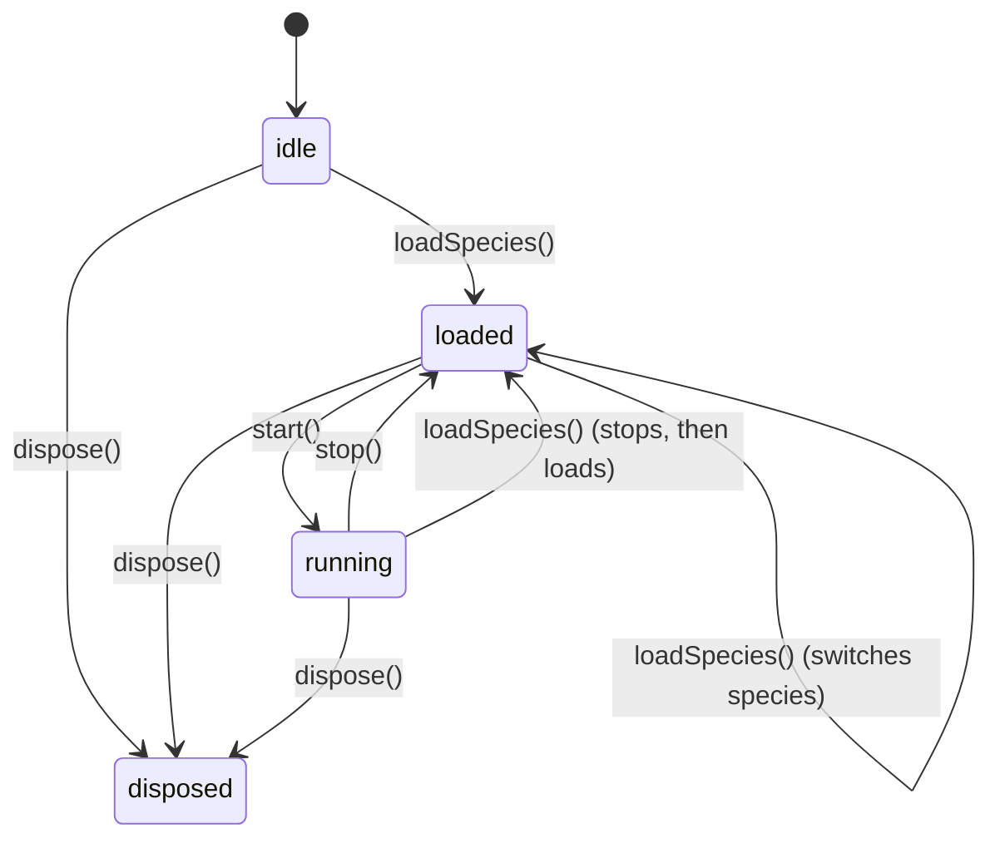

# Engine lifecycle contract

Phase 17 defines explicit lifecycle states for `SpeciesManager` and the rules hosts must follow. **Primary actions throw** when invoked in an invalid state; cleanup actions remain idempotent.

## States

| State | Meaning |
|-------|---------|
| `idle` | No species loaded |
| `loaded` | Species initialized via `loadSpecies()`; audio graph may exist but is not started |
| `running` | `start()` called; `noteOn()` is allowed |
| `disposed` | Terminal — manager was disposed; no further loads |



Query current state: `manager.getState()`.

## Required host sequence

```typescript
const engine = createSpeciesManager();

await engine.loadSpecies('seed'); // idle → loaded
await engine.start();             // loaded → running (awaits audio graph)

engine.setControl('growth', 0.5); // 0–1 only
engine.noteOn('C4', 0.8);
engine.noteOff('C4');

engine.stop();                    // running → loaded (idempotent if already loaded)
engine.allNotesOff();             // idempotent

engine.dispose();                 // → disposed
```

### Throws vs idempotent

| Method | Invalid state behavior |
|--------|------------------------|
| `loadSpecies()` | Throws `EngineLifecycleError` (`ENGINE_DISPOSED`) |
| `start()` | Throws if `idle` (`NO_SPECIES_LOADED`) or `disposed`; **async** — resolves when species audio is ready |
| `noteOn()` | Throws if not `running` (`ENGINE_NOT_STARTED` or `NO_SPECIES_LOADED`) |
| `noteOff()` | Throws if `idle` or `disposed` |
| `setControl()` | Throws `EcologyControlScaleError` if value ∉ [0, 1] |
| `stop()` | Idempotent — no-op unless `running` |
| `allNotesOff()` | Idempotent — no-op in `idle` / `disposed` |
| `dispose()` | Idempotent — no-op if already `disposed` |

`start()` is idempotent when already `running`.

## Error types

### `EngineLifecycleError`

```typescript
error.code  // 'NO_SPECIES_LOADED' | 'ENGINE_NOT_STARTED' | 'ENGINE_DISPOSED'
error.state // current EngineState
```

### `EcologyControlScaleError`

Host-facing controls **must** be normalized **0–1**. Values like `75` throw with a hint to use `0.75`.

Species internals still receive 0–100 via `toSpeciesControlValue()` — hosts should never pass 0–100 to `setControl()`.

### `ReservedSpeciesIdError`

Built-in IDs (`seed`, `flowers`, `mold`, `bacteria`, and future placeholders like `canopy`, `tundra`, …) are reserved. Custom plugins must use namespaced IDs:

- `plantasonic.my-species`
- `custom.my-species`

Bootstrap uses `registerBuiltinSpecies()` with an internal `builtin: true` flag — do not re-register reserved IDs from host code.

## Playable-only default registry

`createSpeciesManager()` registers **four active species only**. `coming_soon` placeholders are **not** in the default registry.

```typescript
manager.getAvailableSpecies(); // same as getActiveSpecies() — playable only

// Opt-in for discovery UIs / docs:
createSpeciesManager({ includeFuture: true });
registerFutureSpecies(registry);
manager.getAllRegisteredSpecies(); // includes placeholders when registered
```

Loading a species that is not registered throws from the loader (`Unknown species`). Loading a registered `coming_soon` species throws `SpeciesNotLoadableError`.

## Singleton exports (deprecated)

`seedSpecies`, `flowersSpecies`, `moldSpecies`, and `bacteriaSpecies` export **metadata only**. For live audio, always use factories:

```typescript
const world = createSeedSoundWorld();
await manager.loadSpecies('seed'); // preferred host path
```

## CI validation

| Script | Purpose |
|--------|---------|
| `validate-species-api.mjs` | Structural API smoke — load, start, note, control per species |
| `test-lifecycle.mjs` | State machine, throws, scale, reserved IDs |
| `validate-species-audio.mjs` | *(Phase 21)* Browser sonic validation |

## See also

- [MIGRATION_V1_TO_V2.md](./MIGRATION_V1_TO_V2.md) — host integration checklist
- [PLUGIN_ARCHITECTURE.md](./PLUGIN_ARCHITECTURE.md) — registry and loader
- [API.md](./API.md) — target public surface (Phase 18 facade)
