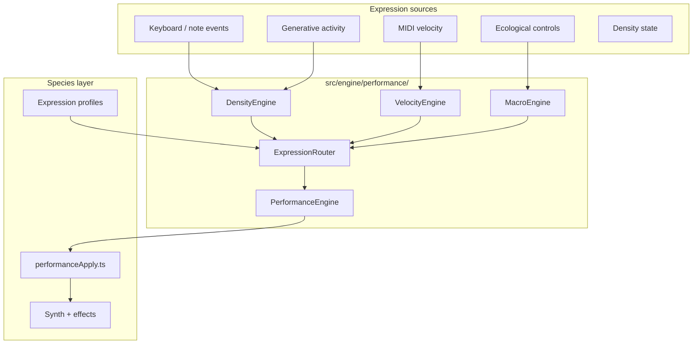

# Performance Engine

> **v2.0.0** — Expressive routing for all live species. Validate: `npm run test:performance` or `npm run test`.

---

## Architecture



### Modules

| Module | Role |
|--------|------|
| `PerformanceEngine.ts` | Orchestrates sub-engines; exposes `noteOn`, `noteOff`, `setEcology`, `getTargets` |
| `VelocityEngine.ts` | Smooths velocity; shapes per-note scale beyond loudness |
| `DensityEngine.ts` | Tracks active notes, average density, phrase/harmonic/drone activity |
| `MacroEngine.ts` | Expands five ecological controls into many target weights |
| `ExpressionRouter.ts` | Central routing — sources → `PerformanceTargets` via species profile |
| `types.ts` | Shared types: profiles, targets, weights |

Species define **expression profiles** (`expressionProfile.ts`) and **apply functions** (`performanceApply.ts`). Routing logic never lives inside species `index.ts` — only application of routed targets.

---

## Expression routing

### Sources

- **MIDI velocity** — normalized 0–1, smoothed over time
- **Keyboard** — note on/off, legato/staccato detection, chord-held state
- **Ecological controls** — growth, bloom, roots, mold, bacteria (via `MacroEngine`)
- **Generative engine** — phrase, chord, drone, ornament, particle events
- **Performance state** — density, phrase complexity, harmonic activity

### Targets

`PerformanceTargets` includes multipliers and additions for:

- Filter cutoff
- Envelope attack / release
- Harmonic brightness
- Chorus depth
- Reverb wet
- Saturation
- Oscillator blend
- Stereo width
- Instability
- Particle rate
- Note velocity scale

Species `performanceApply.ts` maps targets onto Tone.js parameters using stored **base levels** from ecological mapping.

---

## Velocity engine

Velocity influences far more than volume. Each species profile weights how velocity maps to targets:

| Target | Seed | Flowers | Mold | Bacteria |
|--------|------|---------|------|----------|
| Filter | gentle | strong | moderate | bright |
| Attack | softens | moderate | lengthens | short |
| Chorus | subtle | **dramatic** | minimal | light |
| Saturation | warm | light | **strong** | moderate |
| Stereo | minimal | moderate | light | moderate |

Per-note velocity is shaped with a musical curve (`0.35 + v^1.15 × 0.65`) before triggering synth voices.

---

## Density engine

Continuously monitors musical activity:

- Notes currently playing
- Average note density (recent window)
- Phrase activity (generative + live)
- Harmonic activity (chords, overlapping notes)
- Drone activity (sustained generative events)

### Species reactions

| Species | Density response |
|---------|------------------|
| **Seed** | Filter opens slightly; organic warmth |
| **Flowers** | Stereo widens; chorus blooms |
| **Mold** | Instability, tape wear, feedback growth |
| **Bacteria** | Particle rate, pan motion, micro-bursts |

Legato (notes within 280 ms with overlap) shortens effective attack. Staccato (gaps > 90 ms) tightens release.

---

## Macro engine

Ecological controls act as **high-level expressive macros**. Each control expands into partial `PerformanceTargetWeights` defined per species:

- **Growth** — polyphony character, brightness, blend
- **Bloom** — space, chorus, release, harmonics
- **Roots** — filter grounding, slower envelopes
- **Mold** — saturation, instability, degradation
- **Bacteria** — particle density, generative complexity

The UI continues to expose only five knobs. Internal DSP parameters (dozens per species) are driven by macro expansion + performance routing.

---

## Species expression profiles

Profiles live in `src/species/{species}/expressionProfile.ts`.

### Seed

- Character: gentle, musical, warm, organic
- Velocity: filter + warm saturation + soft attack
- Density: slight filter open

### Flowers

- Character: dramatic, blooming, wide
- Velocity: chorus depth, reverb, harmonic brightness
- Density: stereo width expansion

### Mold

- Character: unstable, corrupting
- Velocity: saturation, long attack
- Density: instability, bit crush, feedback, vibrato

### Bacteria

- Character: swarming, microscopic
- Velocity: brightness, blend
- Density: particle rate, pan motion, random bursts

---

## Integration

Each Sound World:

1. Creates `PerformanceEngine(profile)` in `ensureGraph()`
2. Calls `syncPerformanceEcology()` when controls change
3. Records generative activity in generator callbacks
4. On `noteOn` / `noteOff`: updates performance state, applies modulation, triggers voice with shaped velocity

Shared helpers:

- `src/shared/syncPerformanceEcology.ts` — ecology 0–100 → performance 0–1
- `src/species/*/performanceApply.ts` — applies targets to synth/effects

---

## Future MPE compatibility

The router is designed for per-note expression without hard-coded species routing:

- **Per-note pitch bend** — extend `DensityEngine` with note-level bend offsets
- **Channel pressure / aftertouch** — additional source in `ExpressionSources`
- **Timbre (CC74)** — map to brightness / filter targets per profile
- **Slide / polyphonic aftertouch** — per-voice target overrides in `noteOn` context

MPE will add sources to `ExpressionRouter.routeFromSources()` without changing species apply functions.

---

## Testing

```bash
npm run build
npm run test:performance
npm run test:species
```

Confirms profile registration, velocity shaping, ecology macros, density reactions, and reset behavior.

---

## Related docs

- [GENERATIVE_ENGINE.md](./GENERATIVE_ENGINE.md) — composition layer feeding density signals
- [SOUND_WORLD_ENGINE.md](./SOUND_WORLD_ENGINE.md) — Sound World architecture
- [API.md](./API.md) — public contract
