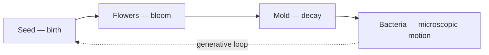
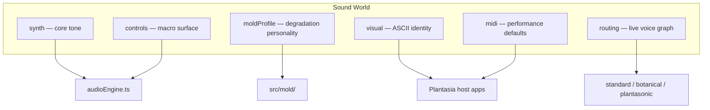
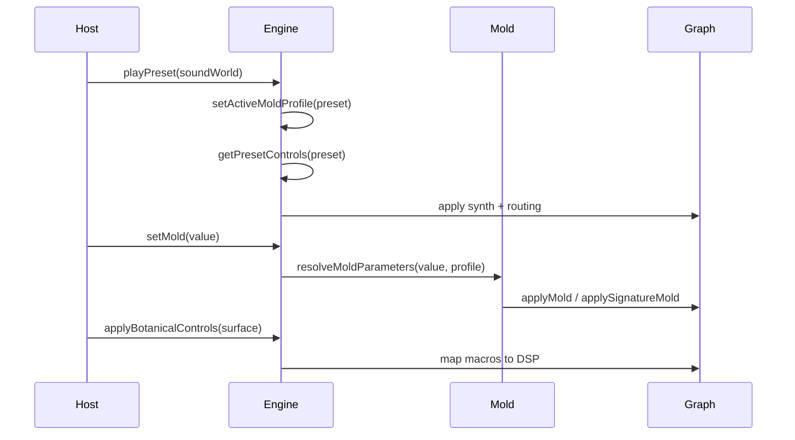

# Sound World Engine

> **v2.0.0 released** — Four live species, plugin registry, generative + performance engines. See [API.md](./API.md).

A Sound World is not a static synth patch. It is a complete expressive environment: synthesis routing, macro controls, degradation personality, visual identity, and MIDI performance defaults — all serialized as JSON and resolved at runtime by the engine.

---

## Why Sound Worlds

Traditional presets capture a single moment: oscillator type, filter cutoff, effect wet levels. They work for recall, but they do not describe *how* a sound lives, ages, or responds to performance.

Sound Worlds model botanical expression:

| Traditional preset | Sound World |
|--------------------|-------------|
| Fixed parameter snapshot | Layered environment with macro surface |
| One degradation curve for all | Mold personality per world |
| Audio only | Audio + visual identity for host apps |
| Generic MIDI mapping | Per-world performance defaults |
| Single synth path | Routed graph (`standard`, `botanical`, `plantasonic`) |

The public API still uses `PlantasiaPreset` and `presets` for backward compatibility. Conceptually, every bundled preset **is** a Sound World.

---

## Organism archetypes

Sound Worlds are organized around four botanical life forces. Each archetype defines a creative direction — not a single preset, but a family of worlds that share sonic DNA.

| Archetype | Life force | Sonic character | Engine anchor |
|-----------|------------|-----------------|---------------|
| **Seed** | Birth | Intimate emergence, damp warmth, the first breath of life | Plantasonic — Plantasia's founding inspiration; soft clusters, close ambience |
| **Flowers** | Bloom | Lush harmonic growth, chorus-rich petals, melodic opening | Juno Flowers — Juno-inspired botanical graph with growth stages |
| **Mold** | Decay | Tape wear, spectral drift, haunted ambient erosion | Living degradation macro — multi-stage aging across all worlds |
| **Bacteria** | Microscopic motion | Particle swarms, random life, cellular jitter and mutation | Procedural motion layer (v2) — generative micro-events, not fixed patches |

### Seed — birth

The origin state. Small, intimate, creeping. Seed worlds (`seed`, `root`) favor muted saturation, slow attack, and low default Mold — sound that has just appeared and not yet weathered. **Plantasonic** is the flagship expression of this philosophy: warm analog ecosystem, organic movement, the core Plantasia inspiration made audible.

### Flowers — bloom

The opening gesture. Flowers worlds (`bloom`, `fern`, `vine`, `juno-flowers`) emphasize harmonic spread, stereo width, and envelope bloom. **Juno Flowers** is the dedicated routing path — a Juno-inspired botanical engine with hold-time growth stages, chorus, and species-aware voice behavior.

### Mold — decay

Not an archetype world but a **force** applied to every world. Mold is the engine's answer to time: tape saturation, wow/flutter, granular mutation, reverse echoes, spectral smearing. At low values it ages gently; at high values it corrupts into haunting ambient terrain. Each Sound World scales Mold differently via its mold profile.

### Bacteria — microscopic motion

The smallest scale of life. Bacteria archetype worlds (planned for v2) target particle-like motion: micro-rhythms, stochastic drift, cellular bursts, and generative variation that never repeats the same way twice. Where Seed is birth and Flowers is bloom, Bacteria is **random life at the edge of perception** — texture as swarm, not melody.



---

## Sound World layers

Each Sound World JSON file composes five layers:



### 1. Synth core (`synth`)

Base tone: oscillator, filter, envelope, effects wet levels, optional detune/drift/saturation. This is the closest layer to a classic preset.

### 2. Control surface (`controls`)

Eight intentional macro defaults (0–100) that host apps expose as creative knobs:

| Macro | Role |
|-------|------|
| `mold` | Living degradation — tape wear, mutation, corruption |
| `tone` | Brightness / filter character |
| `texture` | Timbral grain and cutoff position |
| `bloom` | Space and delay/reverb presence |
| `growthRate` | Envelope attack / release feel |
| `drift` | Slow movement and instability |
| `mutation` | Granular / spectral change appetite |
| `energy` | Sustain and presence |

Explicit `controls` in JSON take precedence. Missing values are derived from `synth` settings via `getPresetControls()` in `src/presets/controlDefaults.ts`.

### 3. Mold personality (`moldProfile`)

Mold is Plantasia's signature living degradation macro. The same 0–100 Mold knob behaves differently per Sound World because each world has a **mold profile** — weighted scaling across eight internal modules (tape wear, harmonic distortion, delay corruption, granular mutation, buffer glitch, spectral decay, pitch instability, texture engine).

Built-in profiles live in `src/mold/profiles.ts` (`MOLD_PROFILES`). Resolve at runtime:

```typescript
import { resolveMoldProfile, getPresetById } from 'plantasia-sound-engine';

const profile = resolveMoldProfile(getPresetById('coral'));
// rainforest profile — dense delay blooms, chaotic ambience
```

Override in JSON:

```json
{
  "id": "crystal",
  "moldProfile": "winter"
}
```

See [SOUND_DESIGN.md](./SOUND_DESIGN.md) for stage behavior (aging → overgrowth) and module detail.

### 4. Visual identity (`visual`)

Host apps (Plantasia 2.0) consume visual metadata for ASCII rendering — theme key, motion style, color palette, intensity, animation tempo. The engine does not render visuals; it ships the contract.

```json
"visual": {
  "asciiTheme": "moss",
  "motionStyle": "breathing",
  "colorPalette": ["#3a5a3a", "#5a7a52", "#7a9a6a", "#2a4028"],
  "visualIntensity": 0.38,
  "animationStyle": "slow"
}
```

Themes are validated against `src/presets/themeRegistry.ts` at build time.

### 5. MIDI defaults (`midi`)

Per-world performance hints: program change slot, mod wheel, expression, pitch bend range, velocity curve. Host apps map these when switching worlds.

---

## Live voice routing

Sound Worlds route live keyboard/MIDI audio through one of three graphs (`LiveVoiceRouting` in `src/utils/types/soundWorld.ts`):

| Routing | When used | Graph |
|---------|-----------|-------|
| `standard` | Default flora / ambient / texture worlds | PolySynth → Filter → Mold → Delay → Reverb |
| `botanical` | Juno Flowers (`botanical` block) | Dedicated Juno graph in `junoFlowersAudio.ts` |
| `plantasonic` | Flagship (`plantasonic` block) | Plantasonic analog ecosystem graph |

Routing is inferred from preset blocks when `routing` is omitted. Signature worlds like Plantasonic and Juno Flowers carry extended routing configs beyond the base `synth` object.

---

## Built-in Sound Worlds

Source of truth: `presets/` (synced to `src/presets/bundled/` at build). Category manifest: `presets/default.json`.

| Category | Worlds | Archetype | Character |
|----------|--------|-----------|-----------|
| `signature` | Plantasonic | Seed | Flagship birth — Plantasia inspiration |
| `soundWorlds` | Seed, Root | Seed | Intimate emergence, earthy roots |
| `soundWorlds` | Bloom, Fern, Vine, Juno Flowers | Flowers | Harmonic bloom — Juno-inspired |
| `ambient` | Coral, Mycelium | Mold / Bacteria | Haunting space, networked particles |
| `textures` | Mutation, Crystal | Mold | Decay, spectral edge, crystalline erosion |

Full schema and mold profile table: [PRESETS.md](./PRESETS.md).

---

## Runtime flow



Typical host integration:

```typescript
import { PlantasiaEngine, getPresetControls } from 'plantasia-sound-engine';

const engine = new PlantasiaEngine();
await engine.init();

const world = engine.presets.find((p) => p.id === 'seed')!;
engine.playPreset(world);
engine.setMold(world.controls?.mold ?? 8);
engine.applyBotanicalControls(getPresetControls(world));
engine.triggerChord(['C3', 'E3', 'G3']);
```

---

## File map

| Path | Role |
|------|------|
| `presets/**/*.json` | Human-editable Sound World definitions |
| `src/utils/types/soundWorld.ts` | Control surface, visual, MIDI, routing types |
| `src/utils/types/presets.ts` | `PlantasiaPreset` schema (Sound World superset) |
| `src/presets/controlDefaults.ts` | `getPresetControls()`, `getPresetMold()` |
| `src/presets/validatePresets.ts` | Sound World metadata validation |
| `src/mold/profiles.ts` | Mold personality registry |
| `src/mold/applyMold.ts` | Standard graph degradation wiring |
| `src/mold/applySignatureMold.ts` | Juno / Plantasonic degradation wiring |
| `src/engine/audioEngine.ts` | Core runtime and botanical mapping |

---

## All four Sound Worlds (Phases 8–11)

Seed, Flowers, Mold, and Bacteria are fully implemented — each with its own synthesis architecture, effects chain, generator, and ecological mappings.

```
src/species/seed/      — Plantasonic-inspired PolySynth + pentatonic generator
src/species/flowers/   — Juno-style saw + pulse + sub + dual chorus bloom
src/species/mold/      — Drone/FM/noise layers + evolving degradation chain
src/species/bacteria/  — Particle micro-voices + probability-driven swarm generator
```

Load via `createSpeciesManager()` → `loadSpecies(id)`. Legacy `playPreset()` and browser demos are unchanged.

Comparison tables (architecture, effects, generator, controls, character): [SPECIES.md](./SPECIES.md#four-species-comparison).

---

## Shared ecological controls (Phase 12)

`EcologyControls` (`src/engine/EcologyControls.ts`) standardizes the five knobs across all Sound Worlds:

```typescript
import { EcologyControls, SpeciesManager } from './engine/index.js';

const controls = new EcologyControls();
controls.set('growth', 0.7);
controls.applyTo(soundWorld);

const manager = new SpeciesManager();
manager.setControl('bloom', 0.4); // normalized 0–1, persisted across loadSpecies()
```

- Values clamped to **0.0–1.0**
- `SpeciesManager` holds state and applies on species switch
- Species mappings stay in each world's `setControl()` — shared names, different behavior

Validate: `npm run test:ecology`

---

## Generative Ecosystem Engine (Phase 13)

All species use the shared generative composition system in `src/engine/generative/`. Species define musical **preferences** (`GenerativePreferences` in metadata); the engine handles phrases, harmony, rhythm, probability, and memory.

See [GENERATIVE_ENGINE.md](./GENERATIVE_ENGINE.md) for architecture, ecological influence on composition, and species integration.

---

## Expressive Performance Engine (Phase 14)

All species use the shared performance system in `src/engine/performance/`. Musical input — MIDI velocity, keyboard performance, ecological controls, generative events, and note density — flows through a centralized **Expression Router** into synthesis targets.

Each species defines:

- `expressionProfile.ts` — how velocity, density, and macros map to expressive behavior
- `performanceApply.ts` — applies routed targets to synth and effects (no routing logic here)

| Species | Expressive character |
|---------|---------------------|
| **Seed** | Gentle, warm, organic — filter opens with activity |
| **Flowers** | Dramatic chorus, blooming harmonics, widening stereo |
| **Mold** | Increasing instability, tape wear, feedback corruption |
| **Bacteria** | Particle swarms, microscopic pan motion, tiny bursts |

Ecological controls remain the only UI-facing knobs; internally they expand into many simultaneous parameter changes via `MacroEngine`.

See [PERFORMANCE_ENGINE.md](./PERFORMANCE_ENGINE.md). Validate: `npm run test:performance`.

---

## Plugin Architecture (Phase 15)

Sound Worlds are **plugins** registered via `SpeciesRegistry`. The engine core never hard-codes species imports — `registerBuiltinSpecies()` is the single bootstrap point.

- **Registry** — validate, discover, prevent duplicate IDs
- **Loader** — load/dispose lifecycle with clear errors
- **Template** — `src/templates/species-template/` for new species
- **Future placeholders** — canopy, moss, spores, mycelium, desert, ocean, rainforest, tundra (`coming_soon`)

See [PLUGIN_ARCHITECTURE.md](./PLUGIN_ARCHITECTURE.md) and [CREATING_A_SPECIES.md](./CREATING_A_SPECIES.md). Validate: `npm run test:registry`.

---

## v2 direction

**v2.0.0 is released** on branch `v2-sound-world-engine` (tag `v2.0.0`). The v1 implementation remains available at tag **`v1-sound-engine-baseline`**.

v2 goals (see [ROADMAP.md](../ROADMAP.md)):

- **Bacteria archetype** — procedural particle motion, stochastic micro-events, generative variation
- Expanded procedural Sound Worlds — variation and generative behavior beyond static JSON
- Unified audio + visual preset system with richer metadata
- Additional creative macro controls
- Formal effect rack and modulation matrix behind the same Sound World contract
- Procedural preset variation at runtime

The public API surface (`PlantasiaEngine`, `presets`, `resolveMoldProfile`, `getPresetControls`) remains the integration boundary. Internal module layout may evolve without breaking semver guarantees on `src/index.ts` exports.

---

## Related docs

- [PRESETS.md](./PRESETS.md) — JSON schema, categories, adding a world
- [SOUND_DESIGN.md](./SOUND_DESIGN.md) — Mold stages, signal flow, botanical mapping
- [ARCHITECTURE.md](./ARCHITECTURE.md) — Subsystem layout and build pipeline
- [GENERATIVE_ENGINE.md](./GENERATIVE_ENGINE.md) — shared generative composition
- [PERFORMANCE_ENGINE.md](./PERFORMANCE_ENGINE.md) — expressive performance routing
- [PLUGIN_ARCHITECTURE.md](./PLUGIN_ARCHITECTURE.md) — species registry and plugin lifecycle
- [CREATING_A_SPECIES.md](./CREATING_A_SPECIES.md) — contributor guide for new Sound Worlds
- [API.md](./API.md) — v2 target public API contract
- [API_V1.md](./API_V1.md) — Current v1 implementation reference
- [ENGINE_AUDIT.md](./ENGINE_AUDIT.md) — v1 audit and migration plan
